# JavaScript Capstone Project - RPG Game

<p align="center">
  
</p>

<h1 align="center">
  Forest Run
</h1> 

> Final project in the Microverse JavaScript Curriculum

Implementation of a Turn-Based RPG Game built with the [Phaser 3](https://phaser.io/phaser3) framework

## Table of Contents

  - [About](#about)
  - [The game](#the-game)
    - [How to play](#how-to-play)
      - [Get local copy](#get-local-copy)
    - [Design](#design)
      - [Player characters](#player-characters)
      - [Enemies](#enemies)
      - [Scenes](#scenes)
  - [Technologies used](#technologies-used)
  - [Contact](#contact)
  - [Contributing](#contributing)
  - [Acknowledgements](#acknowledgements)

## Live Demo

Live Demo Link: [Forest Run](https://forest-run.netlify.app/)

## About

The main objective of this project was to build a platform game. The basics of the game are used from the [GameDev Academy Tutorial](https://gamedevacademy.org/how-to-create-a-turn-based-rpg-game-in-phaser-3-part-1/). But, I had to create the overall design of the game, the different scenes, gameplay and scoring system.

## The game

The character that you will be interacting with, for most of the time, is the Prospector. He was assigned the task of leading two warriors through an enemy infected forest. The only way to get through the forest is to fight against the enemies that stand in the way (they are hidden, but you will know when you get close to them!).

The Prospector will lead the way and find where the enemies are. But, as his name says he is only there to prospect. The two warriors will have to fight with the enemies so they can move on. 

**There are six types of enemies**

- Four main types of enemies, the ones that you have to fight to get through the forest
  - Skeletons
  - Pirates
  - Ninjas
  - Monsters
- And, two secondary types that you fight if you enter into the deep parts of the forest (they are **not** mandatory for finishing the game)
  - Bats
  - Spiders

After defeating each of the main enemies the next ones get stronger and harder to defeat.
  - The skeletons will give you 30 points
  - The pirates 50 points
  - The ninjas 70 points
  - And, the monsters 150 points

If you pass through the forest and fight with only the main enemies you get out with a total score of **300**. 
But, that score increases by 10 points for every secondary enemy group you fight with.

### How to play

**Prospector**

To move around the map with the prospector you use the arrow keys on your keyboard. Each arrow key moves the Prospector in the respective direction.
You will travel through the map, looking for the enemies. When you do come up to a pair of enemies, the screen will switch to the Battle Field.

And, that is when the two warriors come in to play.

**Warriors**

As explained before this is a turn-based game. That means, that when you get into a fight with an enemy group your two warriors are the first ones that attack. After both of them finish, the enemies have their turn at attacking your warriors. And, if after the first round both sides still have at least one living character you move on to the next round. It continues like that, until one side losses both of their characters.

**Fighting** 

When you get switched to the Battle Field you will see you two warriors on the right side of the screen. And, the two enemies on the left side. 
At the bottom of the screen you will see two menus, with the names of the warriors and the enemies.
You start of with the Warrior 1 chosen, to start you first click the **Space** button on your keyboard. With that you choose to attack one of the enemies. 
Then, you use your arrow keys to choose which enemy to attack. (The chosen name gets highlighted in yellow).

When the battle finishes you get switched back to the forest, so the Prospector can lead the way again. Or, to the Game Over screen, depending on the outcome of the battle.

#### Get local copy

*npm required* - [get npm](https://www.npmjs.com/get-npm)

**Clone the repository by running this command in your terminal**
```
git clone git@github.com:ermin-cahtarevic/RPG-game.git
```

**Navigate into the newly created folder**
```
cd RPG-game
```

**Install all of the dependencies**
```
npm install
```

**Bundle the files and start the development server**
```
npm run start
```

**Visit this link to see the game in your browser** [http://localhost:8080/](http://localhost:8080/)

**Run Jest tests**
```
npm test
```


### Design

All of the sprites, backgrounds, buttons and the background music can be found on [OpenGameArt](opengameart.org)

#### Player characters
---
<h4 align="center">
  Prospector
</h4> 
  
<p align="center">
  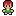
</p>

---

<h4 align="center">
  Warrior 1
</h4> 
  
<p align="center">
  
</p>

---

<h4 align="center">
  Warrior 2
</h4> 
  
<p align="center">
  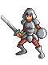
</p>

#### Enemies

---
<h4 align="center">
  Bats
</h4> 
  
<p align="center">
  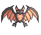
  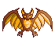
</p>

---

<h4 align="center">
  Spiders
</h4> 
  
<p align="center">
  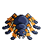
  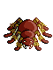
</p>

---

<h4 align="center">
  Skeletons
</h4> 
  
<p align="center">
  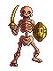
  
</p>

---

<h4 align="center">
  Pirates
</h4> 
  
<p align="center">
  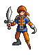
  
</p>

---

<h4 align="center">
  Ninjas
</h4> 
  
<p align="center">
  
  
</p>

---

<h4 align="center">
  Monsters
</h4> 
  
<p align="center">
  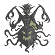
  
</p>

#### Scenes

**Home Screen**

<p align="center">
  
</p>

**Welcome Scene**

<p align="center">
  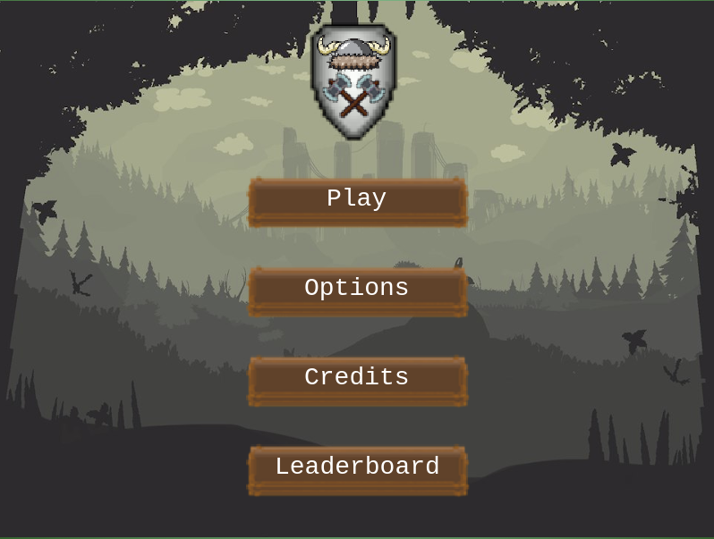
</p>

**Options Scene**

<p align="center">
  
</p>

**Credits Scene**

<p align="center">
  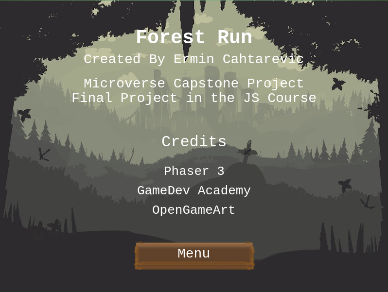
</p>

**Leaderboard Scene**

<p align="center">
  
</p>

**Play Scene**

<p align="center">
  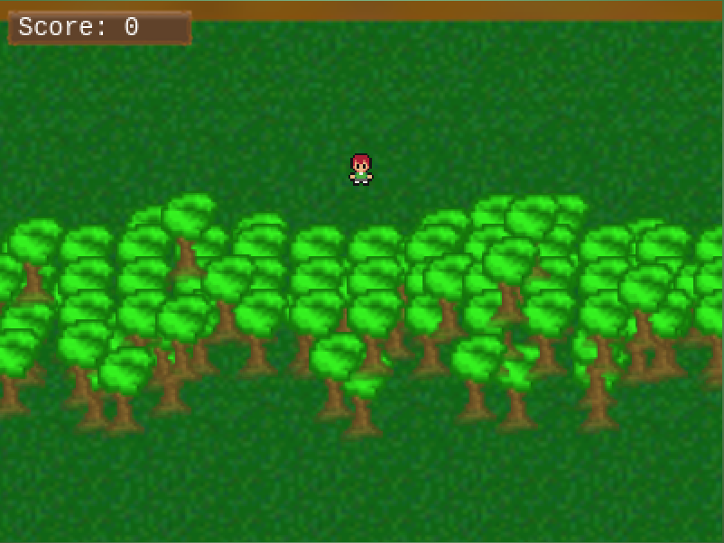
</p>

**Battle Scene**

<p align="center">
  
</p>

**Victory Scene**

<p align="center">
  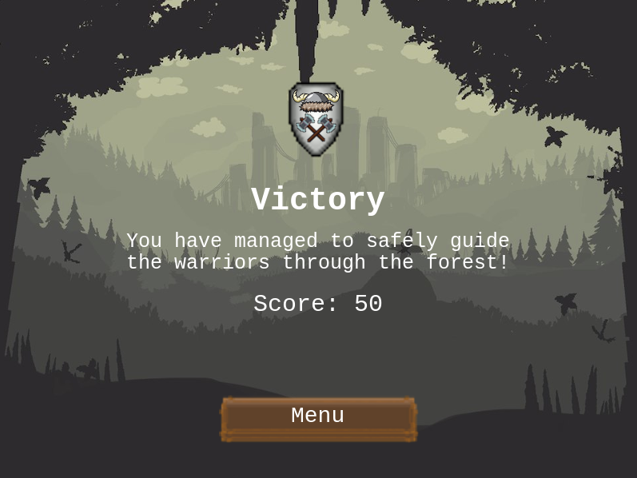
</p>

**Game Over Scene**

<p align="center">
  
</p>

## Technologies used

- JavaScript
- HTML/CSS
- [Phaser 3](https://phaser.io/phaser3)
- Babel
- Webpack
- ESlint
- Jest
- Netlify 
- [Leaderboard API](https://www.notion.so/Leaderboard-API-service-24c0c3c116974ac49488d4eb0267ade3) for tracking scores

## Contact 👤 

- Github: [@ermin-cahtarevic](https://github.com/ermin-cahtarevic)
- Twitter: [@ErminCahtarevic](https://twitter.com/ErminCahtarevic)
- Linkedin: [Ermin Cahtarevic](https://www.linkedin.com/in/ermincahtarevic/)

## 🤝 Contributing

Contributions, issues and feature requests are welcome!

Feel free to check the [issues page](https://github.com/ermin-cahtarevic/RPG-game/issues).

## Show your support

Give a ⭐️ if you like this project!

## Acknowledgments

- Microverse
- Phaser 3
- OpenGameArt 
- GameDev Academy
- Webpack
- npm